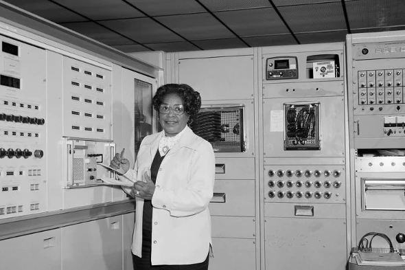
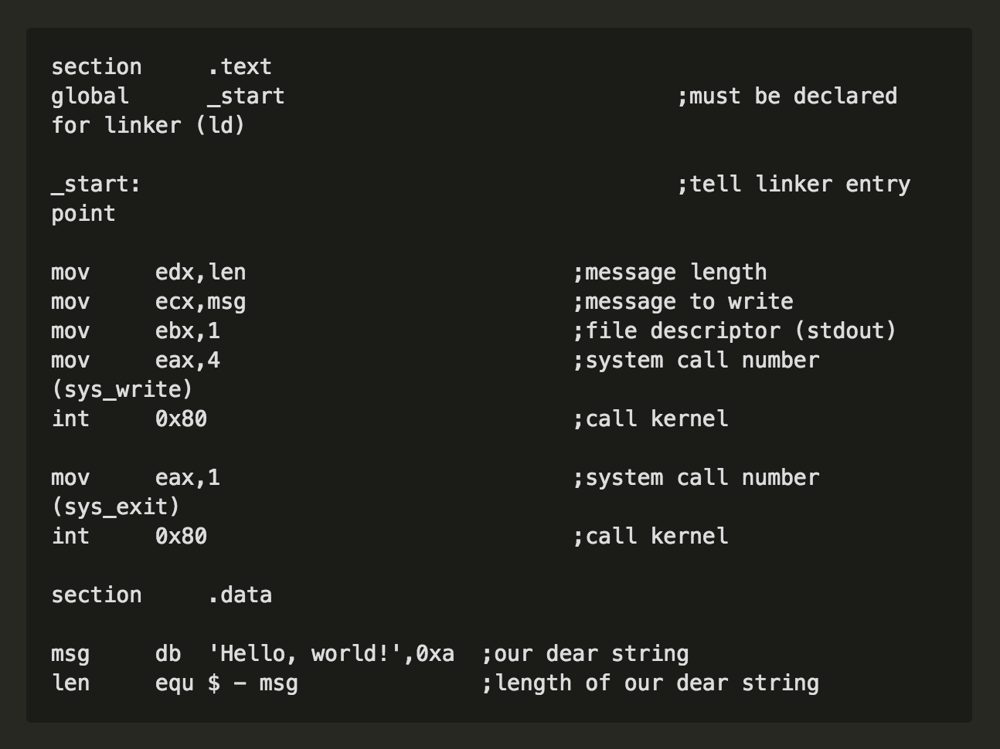
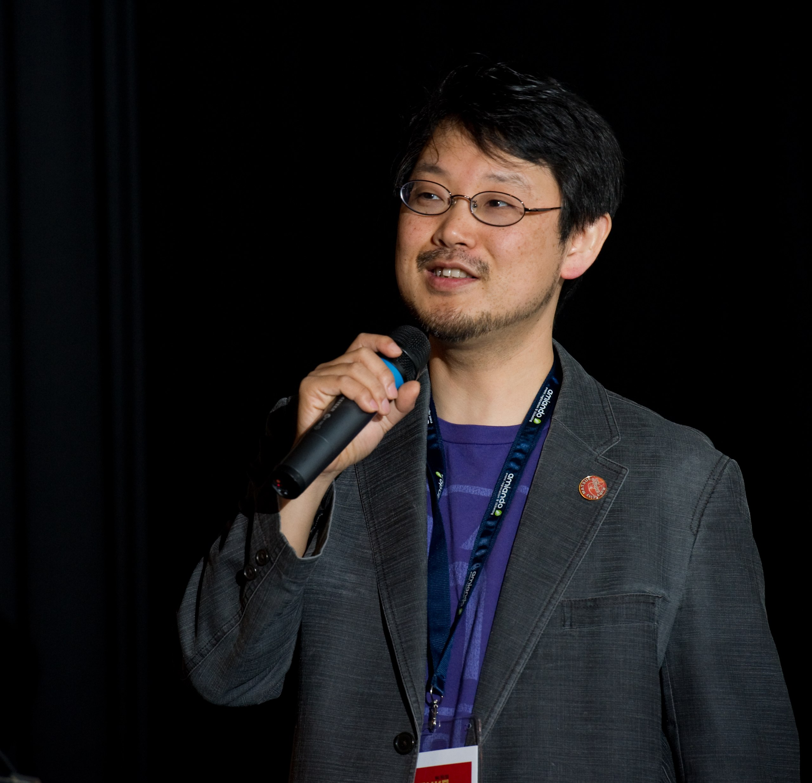

 <!-- .element: class="no-border" -->

#### Network: Health Carousel Guest
#### Password: guestnetwork
#### Slides: [https:basics.gdicincy.com](https://basics.gdicincy.com)
It's so nice to finally meet you!

---
<!-- .element: class="no-border" -->
## Introduction to Programming Concepts
Brought to you by [Girl Develop It Cincinnati](https://www.meetup.com/Girl-Develop-It-Cincinnati/)

Presented by [Talya Flowers](https://www.linkedin.com/in/talyaflowers/)

<!-- <small>Instructor is Talya, your GDI instructor & co-organizer</small> -->

<small>Please tweet and instagram us [@gdicincinnati](https://twitter.com/GDICincinnati/status/865606539427561474)!</small>

---
### Welcome!
Girl Develop It is here to provide affordable and accessible programs to learn software through mentorship and hands on instruction.
#### Some "rules"

* We are here for you!
* Every question is important
* Help each other
* Have fun
---


## A few quick announcements
* WiFi Network is guestnetwork
* Restrooms are down the hall and to the right
* Please be respectful!

Note:Please take phone conversations outside.
---					
### Introductions
* Who are you?
* What do you like to do for fun?
* What do you hope to gain out of this class?
---

# Alright let's get started!

---

## What We'll Be Covering:

* The History of Computing
* How Computers Think
* How Programming Languages Developed
* Basic Programming Concepts
* "What Should I Do Next?"


Note: In this workshop, we'll be sampling from a number of topics,

* (History) starting with running through the history of how computers as we understand them today came to be,

* (Think) how computers think, and how the way humans talk (Languages) to computers has changed.

* (Concepts)Then we'll dig into some top-level programming concepts to lay a nice foundation for your further forays into programming.

* By the end of this workshop, you will also have dabbled in Java, Python, and Ruby, and have an enhanced understanding of many programming jokes.

---

Note:SEGUE: The History of Computing

---
## Computation: <br>The Early Years
---
## Computation: The Early Years

<div style="float: left; width: 33%;">
    
</div>
<div style="float: left; width: 33%; margin: 0 0.5%">
    
</div>
<div style="float: left; width: 33%;">
    
</div>

Examples of some early analog calculators.
<small>From right to left, abacus, astrolabe, sliderule.</small>

Note:
* Computation: The Early Years: Analog Calculators
People have been using tools with varying levels of complexity to make math easier for years, from abacuses for basic math to slide rules for trigonometry for logarithms.
* However, these technologies only went so far in that they had singular purposes and their scope was limited by the space they occupied,
* and as the Industrial Revolution kicked up and global trade started to expand,it became more imperative to get engineers and navigators the appropriate tables of equations so they could do their jobs well.
* These math tables were difficult to reproduce accurately, and folks were feeling the pain.
* In classic infomercial style, THERE HAS TO BE A BETTER A BETTER WAY.

---
## Computation: The Early Years


Diagram of Charles Babbage's Difference Engine.


Note:Computation: The Early Years: Mechanical Calculators
And indeed there was! In 1822, Charles Babbage concepted a mechanical calculator that could print up these tables without risk of human error that he styled the Difference Engine. The British government was all over this in that first year gave him £1,700,
which, in today's money, is roughly $200K.

---
## Computation: The Early Years


An actual difference engine built out.


Note:Computation: The Early Years: The Struggle of Science
However, as far as the British government was concerned, human error still reigned in this case, as the Difference Engine ended up being trapped in development hell — the engine he concepted was too spendy and too complicated to produce at that time and
wouldn't actually be built out until 1989 when it was basically done for fun by the London Science Museum Also to their chagrin, Babbage had gotten distracted by another project in 1837 – an analytical engine that could be used more broadly, had
"memory", and could grapple with loops and conditional branching.


---
## Computation: The Early Years


"A diagram showing Ada Lovelace's program for the computation of Bernoulli numbers, the first program


Note:Computation: The Early Years: The First Program
Babbage's mathematical bestie was also pretty excited about this analytical engine, and when asked to translate a paper on a lecture he gave on the machine in French, in 1843 casually included annotations several times longer than the entire, explaining
why it was so cool. Including an algorithm designed specifically use on the engine, which has the distinction of being the first published computer program.

---
## Computation: The Early Years


Our Lady of Conceptual Programming, <strong class="blue">Ada Lovelace</strong>

Note:Computation: The Early Years: The First Programmer
Said programmer was Ada Lovelace.

---				
## Computation: The Early Years


<i><small>Analytical Engine per Sydney Padua's <strong>The Thrilling Adventures of Lovelace and Babbage</strong>.</small></i>


Note:Computation: The Early Years: How Computers Turned Out
How computers ultimately ended up working primarily looked much different from Babbage’s initial design, because base-ten counting — the numbering system that we're most familiar with and gets the most play in the West, makes for a much more complicated
device then base-two.

---
## Computation: The Early Years


<small><i>Programmers working with the Colossus, a Nazi code-breaking<br> machine and one of the first digital computers.</i></small>

Note:
... the device, however, was just as large.

---

<!-- Computation: The Early Years: How Computers Turned Out, Part 2 -->
## Computation: The Early Years


<small><i>Photo of Mary Jackson in front of NASA's fortran computer</i></small>

Note:
Ms. Jackson from Nasa

---
## How Do Computers Do Their Thinking?
---
## How Computers Think

Computers have three types of memory &mdash;
* <strong class="blue">Read-Only Memory</strong>,
* <strong class="blue">Hard Drive Memory</strong>, and
* <strong class="blue">Random Access Memory</strong>.


Note:
... once digital computers arrived, the base on which computers did all of their thinking, colloquially referred to as “memory,” stabilized into three forms, . It operates a little differently from human memory, but I'll try to make it as clear as possible.

---
## How Computers Think: ROM

<strong class="blue">ROM</strong>, or <strong class="blue">Read-Only Memory</strong>, is hardwritten into chips and handles data essential to a computer's operation.


Note:
ROM, or read-only memory, is memory that’s hardwritten onto chips. This kind of memory is typically responsible for serving up the kind of data that’s your computer would be hard-pressed to operate without — like an operating system. Of course, making
it quick to access means that files in it can’t be edited, and means that your computer won’t forget how to operate when it’s turned off. Do we have any gamers in our midst? Or been down to 16-Bit?

---

## How Computers Think: ROM
<small>Cartridge-based video games are a small example of read-only memory.</small>


Note:

* In the arcade and early home gaming eras, games were printed as read-only memory onto chips and read directly and immediately by their computer systems. One of the pitfalls of writing data to ROM is that space is limited to what you can physically place
on the chips, which is why you don't see many cartridges in use nowadays.

* It did, however, make these games run at a very snappy pace, which is why we may have had to suffer through replaying levels in older games, it wasn't paired with the indignity of having to sit through a loading screen like we do with games on discs.


---


## How Computers Think: ROM
<small><strong class="blue">Read-Only Memory</strong> functions similarly to the brainstem.</small>


Note:
In a computer, it operates a bit like your brain stem — taking care of activities that are necessary to life so you don’t have to spend all of your thinking on performing them, like breathing. I am sorry if you are now thinking about breathing and actively
doing it right now.


---

## How Computers Think: <br>Hard Drive Memory

<strong class="blue">Hard Drive Memory</strong> is editable memory that holds files and programs that you create and install.


Note:
Hard drive memory — not explicitly named as memory, but still, technically memory, holds files and programs on your computer that you create and install. While ROM is fixed, memory on your hard drive can be written and edited, which makes it very much
like long-term memory. When you “save” files, you’re writing them to your hard drive. Flash drives, similarly, are a type of hard drive memory.

---


## How Computers Think: <br>Hard Drive Memory


Note:
The human analogue of this type of computer memory is long-term memory. If you’ve seen the movie Inside Out, the way in which memories are stored is actually pretty similar to how computers hold onto data.

---


<!-- How Do Computers Do Their Thinking: RAM -->


## How Computers Think: RAM

<strong class="blue">RAM</strong>, or <strong class="blue">Random Access Memory</strong> is volatile memory that handles data that the computer is actively using.


Note:
... is volatile — the data it grapples with isn’t ‘written’ anywhere, just temporarily stored on a series of electrified capacitors. The more capacitors there are dedicated to this purpose, the more a computer can do at once. Has anyone had their computer
crash and lost hours worth of work before?

---

<section data-background="images/slide-images/dawsoncrying.gif">
<!-- A picture of a cartoon dog in a burning house staying put and
saying "This is fine." -->
Note:
This is RAM's fault. Yes, dear friends — this is why there’s a whole lot of weeping and your recent work to files is lost to the ether in the case of a computer crash — your RAM doesn’t suddenly loses context and you’re left with a blank slate.

---


## How Computers Think: RAM


Note:
Computers are very much like Drew Barrymore's character in 50 First Dates — doomed to lose any "new" memories whenever she loses consciousness. Both tragic, and a blessing in that, as far as she knows, Adam Sandler's filmography ends in the year 2003.
Fortunately, a lot of programs do some stealth-saving in the background and provide you with recovery files, but that pain and terror is a part of RAM.

---

## How Computers Think: ROM v. RAM

<strong class="blue">ROM</strong> is like our long-term memory.


<strong class="blue">RAM</strong> is like our working memory.


Note:
In this way, RAM is quite a bit like working memory. If you meet someone and exchange telephone numbers, it’s likely that you’ll forget those 7-10 digits when you’re provided with additional distraction unless you make a conscious choice to memorize that
phone number. Meanwhile, Tommy Tutone has ensured that most people of a certain age remember Jenny’s phone number.

---


## How Computers Think: A Review
<ul>
<li><strong class="blue">ROM</strong> handles data that's essential for device operation
<li><strong class="blue">Hard Drive</strong> handles hardwritten, saved data.
<li><strong class="blue">RAM</strong> handles data your computer is using.
</ul>
---


<!-- How We Talk to Computers -->
## How Do We Talk To Computers?
### Programming languages!
---


<!-- The Evolution of Programming Languages -->
## The Evolution of Programming Languages
<ul>
<li><strong class="blue">First Generation</strong>: Machine Code
<li><strong class="blue">Second Generation (1949)</strong>: Assembly Code
<li><strong class="blue">Third Generation (Late 1950s)</strong>: High-Level Language
<li><strong class="blue">Fourth Generation (1980s)</strong>: Even Higher-Level Language
</ul>
---


<!-- First Generation Programming Languages -->
## How We Talk To Computers:
### The First Generation

<strong class='blue'>Machine code</strong>, is the straight-up use of binary as a means of programming.


Note:
When digital computers actually started being made, they ultimately could only be spoken to electronically in a series of zeros and ones — binary — and telling them what to do could only really be accomplished by feeding them punched film or paper or
manually adjusting plugs or switches.

---


<!-- First Generation Programming Languages -->
## How We Talk To Computers:
### The First Generation


Note:
If this sounds like a pain, it’s because it was — a series of zeroes and ones are very far from being immediately meaningful to anyone but computers, who would happily chug away on them.

---


<!-- Second Generation Programming Languages -->
## How We Talk To Computers:
### The Second Generation


Note:
The first response to machine code was assembly code. These languages made use of a program called an assembler that assigned chunks of zeros and ones that had specific purposes to symbolic names.

---


<!-- Second Generation Programming Languages -->
## How We Talk To Computers:
### The Second Generation

<strong class='blue'>Assembly code</strong> is code that uses chunks of text as symbols for specific processes.


Note:
Assembly code… looks vaguely better than a sweep of binary. It was more user-friendly in this respect, but a big problem with assembly languages is that they’re incredibly specific — in that they only work on a single type of computer. Which sounds like
a bummer, but when the number of extant computers was in the low double-digits, there wasn't too much pressure.

---


<!-- Enter the Compiler -->

<!-- A picture of a cartoon dog in a burning house staying put and
saying "This is fine." -->
Note:
For some, this was close enough. As much as they could hope for. And besides, no big deal, computers are just glorified calculators that work really, really fast, right? ... until someone came along who looked at this nonsense and thought "No. This is
not fine. This is ridiculous."

---


<!-- Enter the Compiler: Grace Hopper -->


<small><i>Our Lady of Code Compilation, <strong class="blue">Grace Hopper</strong></i></small>

Note:
This person was Grace Hopper, who, after absolutely crushing it in the Navy during WWII writing programs used on the US's ships, proceeded to absolutely crush it in the private sector and in 1952 wrote the first compiler — a computer program that would
convert honest-to-goodness text, not alphabet soup, into binary that any computer could read.

---

<section data-background="images/slide-images/mindblown.gif">
<!-- Dude dressed as Carl Sagan Cosmos-style getting his mind blown. -->
Note:
This floored her coworkers, but once they were convinced that the compiler didn't bite, it precipitated the next wave of programming languages...

---


<!-- Third Generation Programming Languages -->
## How We Talk To Computers:
### The Third Generation

<strong class='blue'>Third-generation languages </strong> are languages that machine-independent and whose syntax is abstracted and reads in a much more human fashion.

Note:
Third-generation programming languages, machine-independent, abstracted further away from the computer and sounding much more human. These are often referred to as high-level programming languages. For the sake of comparison, here's a 'hello world' program
written in Assembly for Linux...

---


<!-- Third Generation Programming Languages // Before -->
## Before with Assembly


<small><i>A touch of Assembly.</i></small>

Note:


---


<!-- Third Generation Programming Languages // After -->
## After!
```cobol
IDENTIFICATION DIVISION.
PROGRAM-ID. HELLOWORLD.
PROCEDURE DIVISION.
MAIN.
DISPLAY 'Hello, world.'.
STOP RUN
```
<small><i>A touch of COBOL.</i></small>
Note:
... see? Feels so much better and airier already!

---


<!-- Third Generation Programming Languages-->
## How We Talk To Computers:
### The Third Generation

<strong class='green'>Examples: </strong>

* COBOL
* FORTRAN
* BASIC
* C

Note:
This precipitated the creation of a number of languages, some getting more traction than others. Assembly is still used for programs that work closely with hardware and need the device specificity and control, but for programs that humans needed to program
and interact with, high-level languages were the way to go.

---


<!-- Fourth Generation Programming Languages-->
## How We Talk To Computers:
### The Fourth Generation

<strong >Examples: </strong>

* Java
* Python
* Ruby
* MySQL + PostgresSQL


Note:
While there's not a super-distinct boundary between the third and fourth generations, there were definite developments in how programs handled stored data and also in avenues for code use — namely, the emergence of the internet. But by this time, there's
a clear interest in making languages as clear as possible to programmers, which is very nicely summed up in the philosophy of the creator of Ruby, Yukihiro "Matz" Matsumoto. (slide advance)

---


<!-- Fourth Generation Programming Languages-->


<blockquote>I want to see Ruby help <br>every programmer in the world <br>to be productive, and to enjoy programming, and to be happy.</blockquote>
<small>&mdash; Yukihiro "Matz" Matsumoto</small>

Note:
... which, as far as goals go, is both noble and adorable.

---


<!-- Fourth Generation Programming Languages-->
## How We Talk To Computers:
### The Fourth Generation
```ruby
puts 'Hello, world!'
```
<small><i>A touch of Ruby.</i></small>

Note:
... and now most programming languages getting play nowadays look more like this.

---


<!-- Programming Languages: Review -->
# To review...

Note:
And now to review, we're going to look at all of these generations. again, all performing a popular fist program — writing the text "Hello World." to the screen.

---


<!-- Programming Languages: Review -->
## First Generation
<pre><code contenteditable="binary">011010000110010101101100011011000110111100100000011101110110111101110</code></pre>
<small><i>"Hello World" in binary.</i></small>

Note:
This binary slide is kind of a fake-out. This is just the characters for "Hello World" converted into their binary equivalents, this piece of code wouldn't get anything to render on the screen.

---


<!-- Programming Languages: Review -->
## Second Generation

<small><i>"Hello World" in Assembly.</i></small>
---


<!-- Programming Languages: Review -->
## Third Generation
<pre><code contenteditable="cobol">IDENTIFICATION DIVISION.
PROGRAM-ID. HELLOWORLD.
PROCEDURE DIVISION.
MAIN.
DISPLAY 'Hello, world.'.
STOP RUN.</code></pre>
<small><i>"Hello World" in COBOL.</i></small>
---


<!-- Programming Languages: Review -->
## Fourth Generation
<pre><code contenteditable="ruby">puts 'Hello, world!'</code></pre>
<small><i>"Hello World" in Ruby.</i></small>

Note:
This is a great place to stop for a break

---


<!-- How To Talk to Computers -->


<!-- How To Talk to Computers: Computers are kind of dumb. -->
## Learning To Talk To Computers

The best thing about computers is that they <br>will do <strong>exactly</strong> what you tell them to do.
<br><br>

The worst thing about computers is that they<br> will do <strong>exactly</strong> what you tell them to do.

Note:

<strong>STOP Here and demo with TA how exact instructions work</strong>


Now, we start to get to the fun part, where we start talking to computers. However... there are some things to be aware of. While programming languages have gotten easier to read and write, what we ask the computer to do will ultimately be taken by the
compiler and converted into a series of zeros and ones. It is said that the best thing about computers is that they will do exactly what you tell them to do. It’s also said that the worst thing about computers is that they do exactly what you tell
them to do.

Next slide is sandwich demo

---

### Demonstration
<!--Demo how giving exact instructions is really important! -->

<small>`sudo` is computer speak for 'super user do' learn more [here](https://en.wikipedia.org/wiki/Sudo) </small>

Note:
Break students up into groups

20 minutes -> 15 to make instuructions, 5 to discuss

---

# Let's Talk To Computers!
Note:
So, all that being said... it is now time to get computers to do our bidding.

---


<!-- Concepts: Overview -->

## Let's Talk To Computers: Concepts
### 5 Concepts of every Language
<ol>
<li>
Tools *

<li>
Syntax *

<li>
Variables

<li>
Control Structures

<li>
Data Structures *


</ol>
</br>

---


<!-- Let's meet the console. -->
## Tools

* Terminal or command line

* The IDE, Intergrated Development Environment

* The developer community!

Note:
* Terminal or command line - that scary black/white text box

* The IDE, Intergrated Development Environment - vs code, netbeans, codepen etc

* The developer community! - Google, stack overflow, slack!

---

### Syntax


The <b>Syntax</b> of a programming language is the set of rules that define the combinations of symbols that are considered to be correctly structured programs in that language.


Note:
This is what makes each language unique


---


### Variables
<ul>
<li>A variable is a storage container for information.
<li>Examples:
<pre><code>
age = 28
color = "brown"
</code></pre>
<li>There are different kinds of variables based on the information that you want to store.
</ul>
Note:
Some of of you may remember variables from algebra — but if any of you have some post-traumatic stress from this time, fear not — there's no need to solve for anything, variables are our friends, and they help us store information that we can access later
in our code. The computer will be manipulating all of your variables, you will just be telling it how. There are a few different types of information that can be stored as variables — some of which are numbers, strings, and booleans. The variables
in the code chunk above are strings.


---


### Number Variables
<ul>
<li>Number or integer variables are used to store positive or negative whole numbers.
</ul>
<pre><code>
age = 28
year = 2016
</code></pre>
---


### String Variables
<ul>
<li>String variables are used to store text.
</ul>
<pre><code>
name = "Talya Flowers"
myString = 'Hello World'
</code></pre>
---


### Numbers as strings
<ul>
<li>You <b>can</b> store a number as a string variable.
<li>If you store a number as a string variable, you can’t use it in any math calculations.
</ul>
<pre><code>
age = "25"
year = '2018'
</code></pre>
---


### Boolean Variables
<ul>
<li>Boolean variables are used to store the value <b>TRUE</b> or <b>FALSE</b> (yes or no).
</ul>
<pre><code>
am_i_a_cat = false
areMyEyesGreen = true
</code></pre>
---


### Our Sandwich Example as Variables
<ul>
*
What could be a variable?

*
What kind of variable will it be?

</ul>
Note:

<strong>STOP HERE</strong>


Discuss this until the class seems to get the idea


---


### Control Structures

<ul>
<li>Now that you can store data, you probably want to do something with it.

<li>There are two groups of control structures:
<ol>
<li>If/Else statements
<li>Loops
</ol>


</ul>
---


### If/Then/Else
<ul>
<li>If/Then/Else statements evaluate a condition and take actions based on the result.
</ul>
<pre class="fragment">
<code>
if MY_CONDITIONS then DO_ALL_THE_THINGS
else DO_SOMETHING_ELSE_ENTIRELY end
</code>
</pre>
---


### Boolean Operators on Variables
<ul>
<li>Boolean Operators are words or symbols that let you compare, combine, or evaulate input or varaibles to produce an output.

<li>A few examples:
<table class="box copy--small" style="color:white">
<tr>
<td width="200"><code>a == b</code></td>
<td>a is equal to b</td>
</tr>
<tr>
<td><code>a != b</code></td>
<td>a does not equal b</td>
</tr>
<tr>
<td><code>a &lt; b</code></td>
<td>a is less than b</td>
</tr>
<tr>
<td><code>a &gt; b</code></td>
<td>a is greater than b</td>
</tr>
<tr>
<td><code>a &lt;= b</code></td>
<td>a is less than or equal to b</td>
</tr>
<tr>
<td><code>a &gt;= b</code></td>
<td>a is greater than or equal to b</td>
</tr>
<tr>
<td><code>a and b</code></td>
<td>a and b together!</td>
</tr>
<tr>
<td><code>a or b</code></td>
<td>a or b</td>
</tr>
</table>
</ul>
---


### Our Sandwich Example with If/Else
<ul>
*
What conditions do we have?

*
What variables might need to be a different type?

</ul>
Note:

<strong>STOP HERE</strong>


Discuss this until the class seems to get the idea


---

### Loops
<ul>
<li>A loop is a list of instructions that repeats until a certain condition is reached.
<li>
There are while loops, do-while loops, and for-each loops.

</ul>


---


### Loop Examples
<ul>
*
In real life: As long as it's raining, use an umbrella.

*
On an auction like Ebay.com: Allow bids on this item until the auction timer hits 0.

</ul>
</br>
<p class="fragment">
The #1 reason to use a loop is to reduce the number of lines of code you need to write to accomplish a task.

---


### Loops
There are two kinds of loops:

<ul style='width:500px;'>
<li class='fragment'><strong>While</strong> loops
<li class='fragment'><strong>For</strong> loops
</ul>
---


### While loops
A while loop allows code to be executed repeatedly based on a given condition, often based on the value of a variable.
Usually your code will need to change the variable within the body of the loop.
<br />
```java
bottles = 99

while (bottles > 0){
    print bottles
    print ' bottles of beer on the wall'
    bottles = bottles - 1
}
print 'no more bottles of beer!'
```

---


### For loops
For loops are very similar to while loops. They just have a different
syntax. In a for loop, you set up the conditional AND increment or
decrement your variable in the same line.<br/>
```java
for (bottles = 99; bottles > 0; bottles = bottles - 1)
{
    print bottles
    print ' bottles of beer on the wall'
}
print 'no more bottles of beer!'
```

---

### Beware the Infinite Loop!
<ul>
<li>An infinite loop is a loop that will never meet the condition to stop. It will keep going until it's used up all your computer's (or server's) memory (RAM). This is bad!
* In the 99 bottles of beer example:
<ol>
* If the "bottles = bottles - 1" line was missing, it would keep looping because 99 is always greater than 0!
* If "bottles = bottles - 1" was changed to "+ 1", it would keep adding 1 to 99 forever!
</ol>
</ul>
---


### Data Structures
<ul>
<li>
A data structure is a particular way of storing and organizing data in a computer so that it can be used efficiently.

*
Having data structures provides two key things:
<ol>
<li>
Keeps us from repeating code

<li>
Allows us to keep the code flexible

</ol>

</br>
*
In essence, a data structure is just a way to get around having to create tons of variables.

</ul>
---

### Data Structures
<ul>
*
Address book or gmail contacts

*
Ordering systems

</ul>
<p class="fragment">
Data structures are all about genericizing the problem to write the least amount of code.


---


### Data Structures Continued
<ul>
<li>
Every language has it's own set of data structures, and their own unique way of organizing data.

<li>
There are so many types, that we can't cover them all!
<a href="https://en.wikipedia.org/wiki/List_of_data_structures">List Of Data Structures</a>

</ul>
---


<!-- Concepts: Overview -->

## Review!
### 5 Concepts of every Language
<ol>
<li>
Tools *

<li>
Syntax *

<li>
Variables

<li>
Control Structures

<li>
Data Structures *


</ol>
</br>

---

### Thinking like a programmer
#### Revisiting our sandwich making skills

* Problem solving, taking those tools and using them in different ways to find an answer
* How would you change your sandwich "program"?


Note:
If we have time open up codepen and write a JavaScript version of their program!
https://www.youtube.com/channel/UCLEMTlEe5RE04EoULMHWEEQ

---

### Congratulations!


---


### Coding Classes Resources (most are free) and Books
<ul>
<li>Code year:<a href="http://www.codecademy.com/tracks/code-year" target="_blank">www.codecademy.com/tracks/code-year</a>
<li>Codecademy: <a href="http://www.codecademy.com" target="_blank">www.codecademy.com</a>
<li>Coursera: <a href="https://www.coursera.org" target="_blank">www.coursera.org</a>
<li>Free Code Camp: <a href="https://www.freecodecamp.com/">www.freecodecamp.com/</a>
<li>Kahn Academy: <a href="https://www.khanacademy.org" target="_blank">www.khanacademy.org</a>
<li>Skillcrush: <a href="http://skillcrush.com" target="_blank">www.skillcrush.com</a>
<li>Udacity: <a href="https://www.udacity.com" target="_blank">www.udacity.com</a>
<li>Udemy: <a href="https://www.udemy.com" target="_blank">www.udemy.com</a>
<li>Think Like a Programmer: <a href="https://www.youtube.com/channel/UCLEMTlEe5RE04EoULMHWEEQ">Youtube Videos by V. Anton Spraul</a></li>
<li>And of course, <a href="http://www.girldevelopit.com/chapters/dayton" target="_blank">GDI Dayton!</a>
<li> <a href="http://www.amazon.com/Program-Second-Edition-Facets-Series/dp/1934356360" target="_blank">Learn to Program</a>, by Chris Pine
<li> <a href="http://www.amazon.com/Everyday-Scripting-Ruby-Teams-Testers/dp/0977616614/ref=sr_1_1?s=books&ie=UTF8&qid=1405369294&sr=1-1&keywords=everyday+scripting+with+ruby" target="_blank">Everyday Scripting in Ruby</a>, by Brian Marick
</ul>
---

### Upcoming Workshops/Classes

*Code and Coffee Workshop-Build WebVR with Matt Fisher Monday, July 30

*SEO and/or Wordpress Workshop Tuesday, August 7

*Intro to HTML/CSS at Sogeti, August 14, 16, 21, & 23

*CSS Animation Workshop at Quotient, August 28 or August 30


---


### Class survey
<a href="https://docs.google.com/forms/d/e/1FAIpQLSeORna_SsOgLqF_CE8josY0wFIRp0KSBrIVjq3IW8ZyplPoLg/viewform?c=0&w=1">http://bit.ly/proconcepts</a>
---
